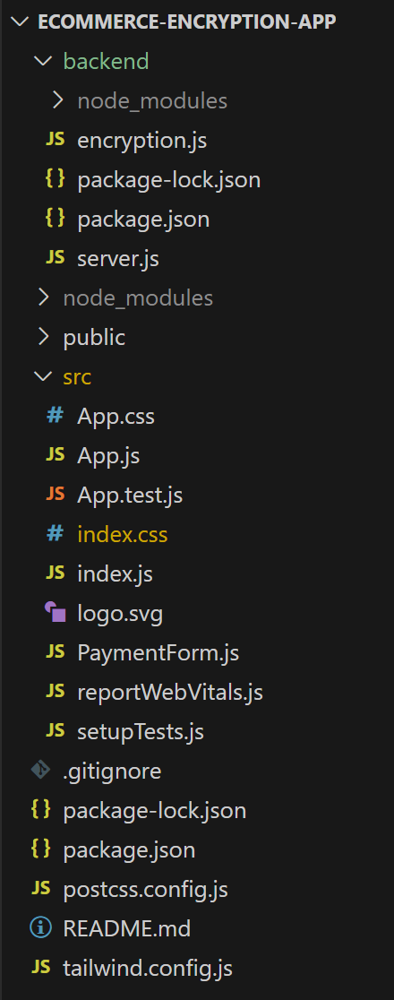

# Secure E-commerce Application with Custom Payment Encryption

This project implements a comprehensive cybersecurity system for data encryption in an e-commerce application. The application is built with React for the frontend and Express.js for the backend, utilizing custom encryption methods for secure payment processing.

## Table of Contents
- [Features](#features)
- [Technologies Used](#technologies-used)
- [Setup and Installation](#setup-and-installation)
- [Running the Application](#running-the-application)
- [Project Structure](#project-structure)
- [Acknowledgments](#acknowledgments)
- [License](#license)

## Features
- Secure user registration and login with encrypted credentials.
- Single-page landing page showcasing an e-commerce product.
- Custom payment processing with encrypted data.
- Local file storage for user and payment data.

## Technologies Used
- Frontend: React.js, Tailwind CSS, shadcn
- Backend: Express.js
- Encryption: Node.js Crypto module

## Setup and Installation

### Prerequisites
- Node.js (v12 or higher)
- npm (v6 or higher)
- Git

### Installation

1. **Clone the repository:**
   ```sh
   git clone https://github.com/your-usernhttps://github.com/TLodosDurak/EcommerceSecurity.git
2. **Set up frontend:**
    ```sh
    cd frontend
    npm install
3. **Set up backend:**
    ```sh
    cd ../backend
    npm install
### Running the Application

1. **Start the backend server:**
    ```sh
    cd backend
    node server.js
2. **Start the frontend development server:**
    ```sh
    cd ../frontend
    npm start
3. **Access the application:**
- Open http://localhost:3000 to view it in your browser.

### Project Structure



### Acknowledgments

- This project was bootstrapped with Create React App.
- Styling is achieved using Tailwind CSS.

### License

- This project is licensed under the MIT License - see the LICENSE file for details.


